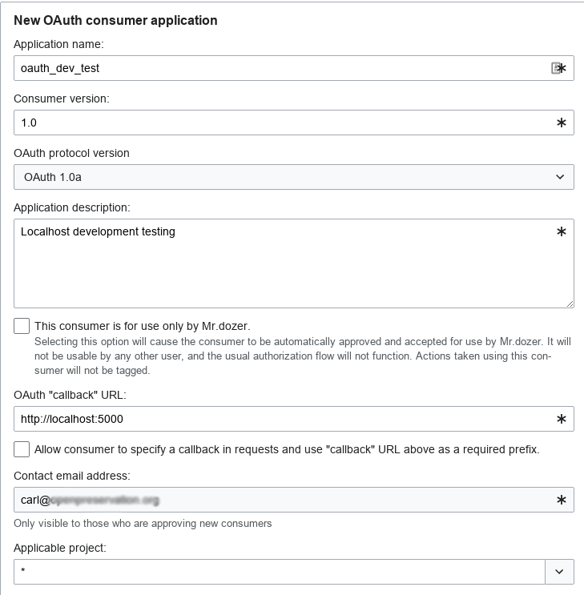
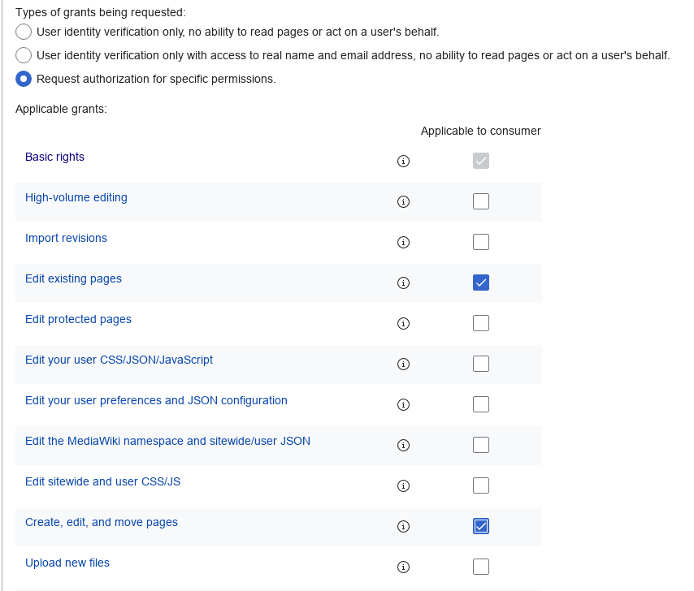
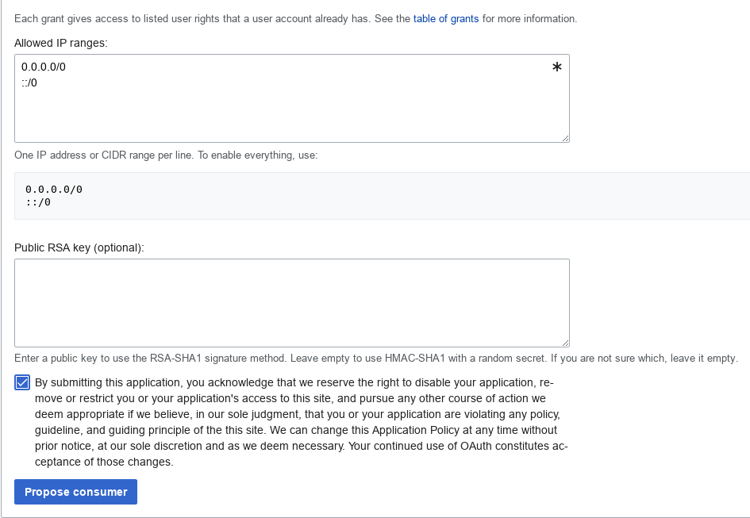
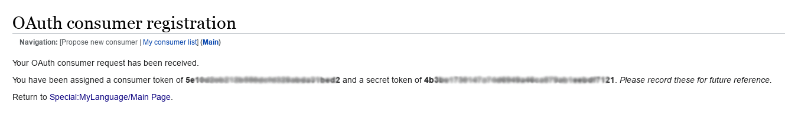

Developing With OAuth
=====================

Introduction
------------
WikiDP uses the OAuth protocol to allow proxy login to the WikiData site. While this
is convenient for site users, the key is tied to the main WikiDP domain: wikidp.org.
This poses problems for developers as it's impossible to use the main site access
token on a local machine. This is a quick guide to obtaining and setting up an OAuth
token for local development.

Pre-requisites
--------------
We assume that you have the software up and running using the [instructions here](../README.md).
You'll also need a [Wikimedia account](https://en.wikipedia.org/wiki/Wikipedia:Why_create_an_account%3F)
both to obtain an OAuth token and to log on to your WikiDP dev instance.

Getting an OAuth Token
----------------------
First you'll need to request an OAuth token from Wikimedia for your development instance.
This special page <https://meta.wikimedia.org/wiki/Special:OAuthConsumerRegistration/propose>.
Wikimedia's general OAuth instructions for developers are here:
<https://www.mediawiki.org/wiki/OAuth/For_Developers> but we show a full example
below with screenshots that meets WikiDP's requirements. The first part of the
OAuth form is shown below. You'll need to propose a unique name in the first form field: "Application name", and use your own email address. Everything else should
be indentical.



The second half of the form specifies the grants for permissions and should look
the same as the diagram below:



Finally there are some details about IP blocking and RSA keys, this should be filled
out as below:



Hi the "Propose consumer" button and you'll get the consumer and secret tokens as
shown below. **PLEASE SCREENSHOT OR CAPTURE THESE NOW, ONCE THE PAGE IS CLOSED YOU
WILL NOT BE ABLE TO RETRIEVE THEM AGAIN**.



Now you will have to wait for confirmation from the Wikimedia team, this usually takes
24-48 hours maximum and will be returned to you via email. Once you receive the
confirmation you can set up your development environment.

Using your Token for Development
--------------------------------
The easiest way of running a development instance is to use the local development
Docker image. You'll need to build a Docker image locally, from the project root:

```
docker build -t wikidp-dev -f Dockerfile.dev .
```

This creates a local image called `wikidp-dev`. You can now run this while adding
your OAuth details as environment variables like so:
```
docker run -p 5000:5000 -v "$PWD":/wikidp --rm -e WIKIDP_CONSUMER_KEY='<consumer-token>'-e WIKIDP_CONSUMER_SECRET='<secret-token>' --name wikidp-dev wikidp-dev
```
